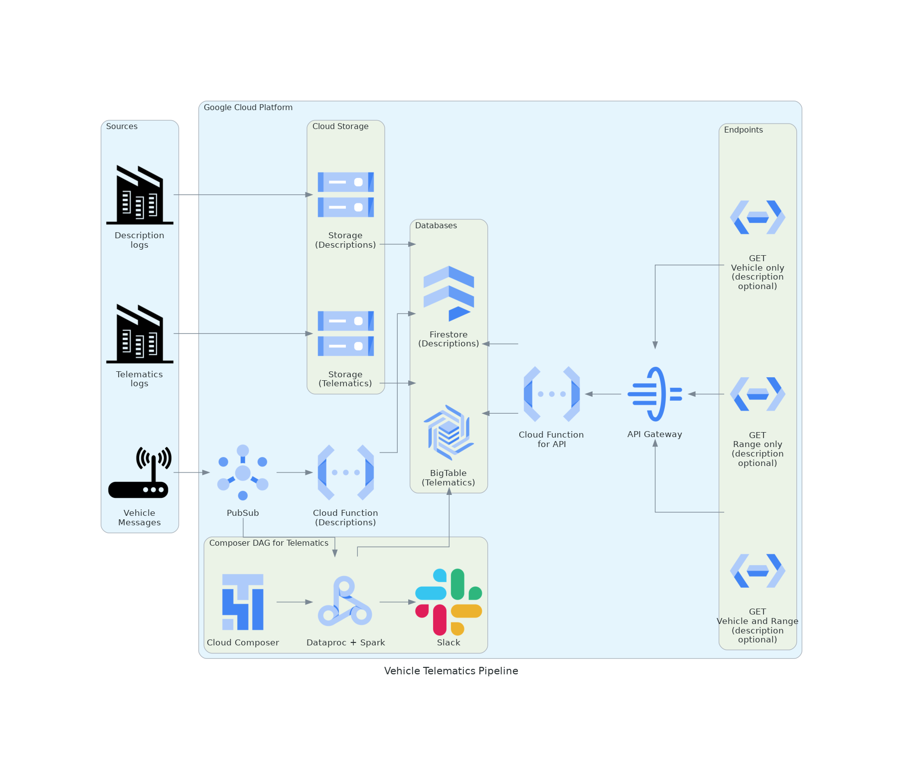

# First question - Vehicle Telematics

## Sources
Sources of real-time messages and history.
### Vehicle
All real-time messages sent by the vehicle, including telematics and description. For this model they are being sent by a streaming service and will be captured by PubSub.
### History logs
The logs of previously captured telematics and description messages. For this model they are .JSON files with raw content located on premise. They will be directly uploaded to Cloud Storage.
## Google Cloud Platform
All data processing will be made using GCP tools.
### PubSub
PubSub will act as middleware between streamed vehicle messages and databases/orchestrator. It will detect messages and define if they have telematics schema or description schema.
* Telematic messages: Will be sent to Dataproc Spark Streaming and trigger a Cloud Composer workflow.
* Description messages: Will trigger a Cloud Function that will store them in a Firestore Database.
### Cloud Composer
It will orchestrate a workflow according to a simple DAG as soon as a new telematics message arrives. The DAG should ensure an SLA of 2h.
#### Dataproc
Running Spark Streaming inside. It will execute telematic data transformation, ensure data quality and send them to BigTable. If there is some error or if SLA is over, a message is sent to a message app (in this example, Slack).
### Telematics Storage
It will store raw historic data from Telematics and will programatically feed BigTable.
### BigTable
Responsible to persist all telematics data as NoSQL tables. They may be partitioned by _vehicle_id_ due to high data volume, this way the indexes should be datetime related and make the search faster. BigTable will be available for queries using Cloud Function. _timestamp_ will be the primery key.
### Description Storage
It will store raw historic data from vehicle description and will programatically feed Firestore.
### Cloud Function (for Description)
It will receive descriptions from PubSub and store them in Firestore.
### Firestore
It will store the description of each vehicle in a NoSQL table. There's no need for BigTable here since data volume is too low. Firestore will be available for queries using Cloud Function. _vehicle_id_ is the primery key.
### Cloud Function (for API requests)
It will be triggered whenever an endpoint is called. It will generate a job instance for each request that will consult BigTable (and Firestore if needed). The BigTable queries may return an excessive ammount of results, so the use of Jobs is needed. It will return as API response like the one below, for simple access to the job results:
```
{
  jobId: 43243-324234-4242-356567,
  url: https://bigquery.googleapis.com/bigquery/v2/projects/{projectId}jobs/43243-324234-4242-356567
}
```
### API Gateway
Manages the API calls below. It has authenticated access to Cloud Functions and will run the query when called.
### Endpoints
We will need three endpoints, with the format below:
* Vehicle only (with option for showing description)
  * GET /vehicle/$ID?description=$BOOL
* Range only (with option for showing description)
  * GET /range/$START/$END?description=$BOOL
* Vehicle and Range (with option for showing description)
  * GET /vehicle/$ID/range/$START/$END?description=$BOOL
## Second question - Queries
As stated before, all queries will run a Cloud Function which will create a job that accesses BigTable and Firestore according to the request.
A Cloud Function will only be charged when accessed, so cost of only 200 requests a day will not be a problem here.
### Vehicle only
As BigTable will be partitioned by _vehicle_id_, only _vehicle_id_ will be queried. if _description_ is also requested, a search into Firestore by _vehicle_id_ will be made.
### Range only
It will query by _timestamp_ in all partitions, then sort them in ascending order. After the results, if _description_ is also requested, a search into Firestore by all _vehicle_id_ found before will be made.
### Vehicle and Range
_vehicle_id_ and _timestamp_ will be queried. if _description_ is also requested, a search into Firestore by _vehicle_id_ will be made.

[Example of querying BigTable from Cloud Function.](https://cloud.google.com/bigtable/docs/samples/bigtable-functions-quickstart?hl=pt-br#bigtable_functions_quickstart-nodejs)

## Third Question - Costs
Values calculated using [Google Cloud Pricing Calculator](https://cloud.google.com/products/calculator). Based on values from October 29th, 2023.
### PubSub
| Description | Value |
| --- | --- |
| Message delivery type | Basic |
| Volume: 20 GiB daily | USD 23.37 |
| Subscriptions: 1 | USD 23.37 |
| Total | USD 46.74 |
### Cloud Composer:
| Description | Value |
| --- | --- |
| Environment: Small (730 hours) | USD 328.50 |
| Compute mCPU: 1,460 | USD 84.68 |
| Compute Memory: 5,475 GiB | USD 32.85 |
| Compute Storage: 2,920 GiB | USD 0.88 |
| Database Storage: 1 GiB | USD 0.22 |
| Total | USD 447.13 |
### Dataproc:
| Description | Value |
| --- | --- |
| Data Compute Units(vCPU): 36 DCU | USD 2,031.63 |
| Data Compute Units(RAM): 24 DCU | USD 1,354.42 |
| Shuffle Storage: 15,000 GiB | USD 1,800.00 |
| Total | USD 5,186.05 |
### Cloud Storage:
| Description | Value |
| --- | --- |
| Location | London |
| Total Amount of Storage: 8,192 GiB | USD 188.42 |
| Always Free usage included: | No |
| Total | USD 188.42 |
#### Note:
* Cloud Storage will not be needed after full migration.
### Cloud Functions:
#### Descriptions from PubSub to Firestore
| Description | Value |
| --- | --- |
| Region | London |
| Invocations: 30,000 | USD 0.00 |
| RAM (GiB-seconds): 1,875 per month | USD 0.00 |
| CPU (GHz-seconds): 3,000 per month | USD 0.00 |
| Minimum number of instances: 1 | USD 1.37 |
| Total | USD 1.37 |
#### API Calls
| Description | Value |
| --- | --- |
| Region | London |
| Invocations: 6,000 | USD 0.00 |
| RAM (GiB-seconds): 7,500 per month | USD 0.00 |
| CPU (GHz-seconds): 12,000 per month | USD 0.00 |
| Minimum number of instances: 1 | USD 1.37 |
| Total | USD 1.37 |

#### Notes:
* A portion of estimate fits within the Cloud Functions free tier.
* Minimal number of instances is 1 to avoid cold starts.

### BigTable:
| Description | Value |
| --- | --- |
| Bigtable nodes | 4 |
| Number of hours per month | 730 hours per node |
| Region | London |
| SSD storage | 16 TB per month |
| Total | USD 5,554.40 |

#### Notes:
* 16 TB is an estimation for log ingestion plus new messages. After complete migration we can use less SSD storage.
* Only 5 TB per node are allowed.
### Firestore:
| Description | Value |
| --- | --- |
| Total Document Reads per month | 3,041,666.667 |
| Total Document Writes per month | 3,041,666.667 |
| Total Data Stored | 0.010 GiB |
| Total | USD 3.40 |

#### Notes:
* A portion of estimate fits within Firestore free tier.
* Assuming half of requests include "description" option.
* Assuming about 100 kB per description document.

### API Gateway:
| Description | Value |
| --- | --- |
| From 0 to 2 million calls |	US$ 0,00 |
| Total | USD 0.00 |

#### Notes:
* 200 requests per day, 6000 per month.
* Using [pricing table](https://cloud.google.com/api-gateway/pricing). Cost is USD 0.00 from 0 to 2 million API calls.

## Total estimate
Total Estimated Cost: USD 11,428.87 per 1 month.